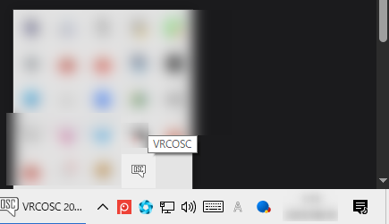
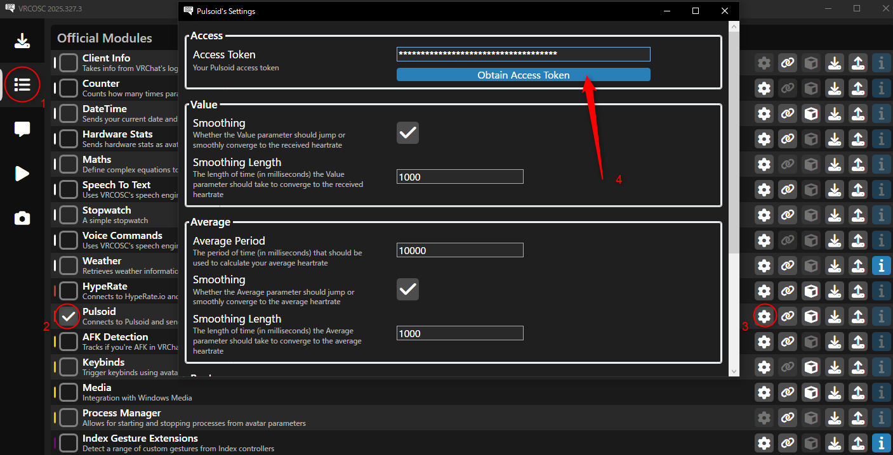

import Tabs from '@theme/Tabs';
import TabItem from '@theme/TabItem';

# OSC機能について

:::caution
2.0からアップデートする方へ  
**OSC送信アプリが変更されました！** 3.0からはPulsoidとBLEの両方で共通のアプリを使用します。古いアプリは使用できませんのでご注意ください。  
古いアバターでも使用する方法を[こちら](#old-avatar)で案内しています。
:::

:::note
心音ギミックの使用に必須ではありません。
:::

心拍数をVRChatに送信することで、心拍数をリアルタイムでアバターと同期させることができます。  
お手持ちのスマートウォッチを介したPulsoidを使用する方法と、Bluetooth Low Energy (BLE)対応の心拍計を使用する方法があります。  
||Pulsoid|BLE|
|:---|:---|:---|
|長所|スマートウォッチをそのまま使用可能|心拍数取得精度が良い 電池が長く持つ |
|短所|スマートウォッチの電池持ちが悪い 導入と起動が面倒|別途購入が必要|

MibandやApple Watchなどのスマートウォッチをお持ちの場合は、まずはPulsoidを試してみることをオススメします。  
ただし、専用の心拍計であればスマートウォッチよりも精度が高く電池の持ちも良いことが多いです。  
導入や起動もPulsoidに比べてかなりシンプルで非常に楽です。  
[オススメの心拍計](https://www.amazon.co.jp/dp/B08882MGXD) です。安いタイミングなら4000円以下で買えます。 

機能性ではBLEの方が優れているので、ギミックがお気に召したらBLE対応の心拍計を購入してみるのも良いでしょう。

よろしければこちらも参考にしてください。  
[VRChatに心拍数を送る時の環境メモ](https://note.com/bekosan/n/nf6a976867771)

## 導入方法

<Tabs>
    <TabItem value="common" label="共通">
        1. VRCOSCの設定
            1. https://github.com/VolcanicArts/VRCOSC/releases/latest  
            から **VRCOSCSetup.exe** をダウンロード

            1. インストールが完了したらアプリを起動します。起動したはずなのにウィンドウが出ない場合は、タスクバー右の隠れているアイコンを表示するボタンを押してみてください。  
              
            もし、VRCOSCのアイコンが2つ以上ある場合は多重起動で不具合の原因となるので、残り1つになるまで右クリックから終了してください。
    </TabItem>
</Tabs>

<Tabs>
    <TabItem value="pulsoid" label="Pulsoid">
        :::caution
        ！必ずお持ちの端末がPulsoidに対応しているか確認してください！  
        https://www.blog.pulsoid.net/monitors
        :::
        1. Pulsoidの設定  
            https://note.com/kendesu/n/n81275f17986a の 3.2 までを真似する  
            
        1. Modulesタブに移動し、Pulsoidにチェックを入れます。歯車マークをクリックし、 `Obtain Access Token` をクリックします。
        

        1. 右下の Authorize App を押すとトークンが伏せ字で表示されるので、Copy to clipboard でコピーしておきます。  
        **トークンが漏れると他人から心拍数が取得出来てしまうので取り扱いには注意してください。**

        1. VRCOSCの設定画面に戻り、Access Token 欄にペーストします。

        1. Runタブを開き、緑色の再生ボタンを押して起動します。
    
    </TabItem>
    <TabItem value="ble" label="Bluetooth LE">
        :::note
        Bluetooth Low Energy（BLE）に対応した心拍計が必要です。
        :::
        
        

        1. WindowsにBLE心拍計をペアリングします。  
        :::caution
        Windows11 22H2, 23H2の場合、「Bluetoothデバイスの検出」設定を「詳細」に変更してください。  
        24H2では、Bluetoothデバイスの検索で、Bluetoothデバイスのリストを下にスクロールして「すべてのデバイスを表示」を選択してください。
        :::

        2. Packagesタブを開き、Bluetooth Heartrateの最新モジュールをインストールします。(マニュアル執筆時現在)  
        

        1. その下のModulesタブを開き、Bluetooth Heartrateにチェックを入れます。

        1. Runタブを開き、緑色の再生ボタンを押して起動します。
    </TabItem>
</Tabs>

## VRCOSC おすすめ設定

Settingsタブを開きます。
- General
  - Tray
    - Send To Tray On Close: ☑
    - Start In Tray: ☑
- Behavior
  - Modules
    - Run With VRChat: ☑
    - Stop With VRChat: ☑
- Speech (使用しない場合)
  - Configure
    - Enable Speech Engine: □

## 古いアバターをVRSOSCに対応させる  {#old-avatar}

:::warning
複数のOSC送信アプリが起動していると、競合により正常に動作しません。古いアプリは削除してください。  
また、この回避策は一時的なものにとどめ、できるだけ早く全てのアバターを更新することをおすすめします。
:::
1. Modulesタブを開き、PulsoidとBLEの使用する方のチェーンマークをクリックします。

1. Average欄のNameを `HR` に変更します。

