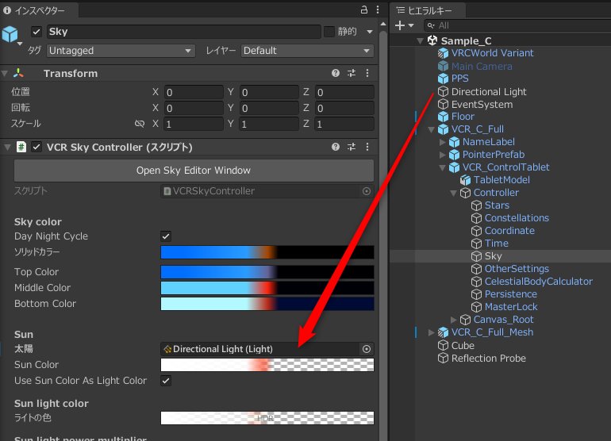
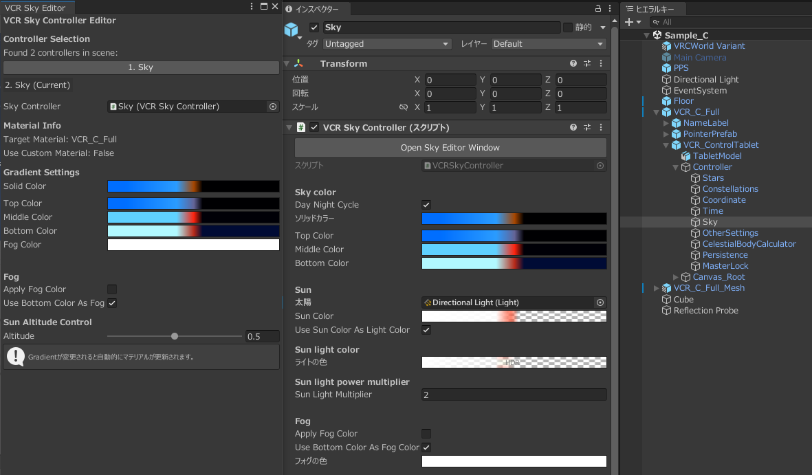

# 設定（B、Cセット）

## 導入手順 {#installation}
_BekoShop/VirtualCelestialRenderer/Main/Materials_ にある BかCの対応するマテリアルをスカイボックスに適用します。任意のメッシュに適用したい場合は、 _Mesh が付いている方を使用してください。  
次に、Main/Prefabs 内にある対応するプレハブをヒエラルキーの任意の場所に配置します。  
最後に、Cセットの場合はタブレットとポインターをワールド内の配置したい場所に移動してください。
:::caution
Cセットの場合、初回インポート時に Text Mesh Pro のダイアログが表示される場合があります。  
必ず "import TMP Essentials" を選択してください。下の "Examples & Extras" は不要です。
:::

### 太陽を同期させる（任意）  {#synchronize-the-sun}
太陽として動かしたいリアルタイムのディレクショナルライトを、  
Bプレハブは _VCR_B_Limited/Scripts/Sky  
Cプレハブは _VCR_C_Full/VCR_ControlTablet/Controller/Sky  
のオブジェクトに付いているスクリプトの Sun にアタッチしてください。
指定されたライトは回転、色、明るさが自動制御されます。

---
## マテリアル設定 {#material-settings}
一部設定はAセットと共通ですが、スクリプトによっていくつかの項目が上書きされます。  
Cセットの場合はタブレットからも変更可能です。

### 上書きされる設定 {#overridden-settings}
- Sky Color セクションの色に関する設定  
スクリプト設定から時間経過によるそれぞれの色を変更可能です。  
**マテリアル上で設定しても上書きされてしまいます。** 空の色を変えたい場合は、後述の [スクリプト設定](#sky) をご覧ください。
- Sun および Moon セクション  
太陽と月はスクリプトによって位置、明るさ、月相等が自動制御されます。
なお、太陽と月の大きさは自由に設定可能です。

### Sky Color　（空の色） {#sky-color}
- Sky Brightness  
空の明るさを指定します。0で真っ暗、1で指定した空色が反映されます。
- Middle / Top offset  
空色の境目の高さを指定します。
- Middle / Top Blend  
空色の境目のブレンド率を指定します。0で境目がはっきり、1で境目がぼやけます。
- Mirror Below Y=0  
空の色を地平線より下にも反映するかを選択します。オフの場合はBottom Colorが反映されます。
### Celestial Sphere　（天球） {#celestial-sphere}
- Base Rotation  
天球の方角を指定します。デフォルトでは+Z軸方向が北です。
### Stars　（星） {#stars}
- Star Size  
星の大きさを指定します。値が大きいほど星が小さくなります。
- Star Brightness  
星の明るさを指定します。高くするほど見えやすく、周辺光で消えにくくなります。
- Medium / Dim Star Brightness  
普通な星と暗い星の明るさをそれぞれ指定します。暗い星はギリギリ見えるくらいがおすすめです。
- Color Boost  
星の色を増幅します。0だと全ての星が白色になります。
- Twinkle Speed / Intensity  
星のきらめきの速さと強さを指定します。
### Sun　（太陽） {#sun}
- Draw the Sun
太陽を描画するか否かを設定します。
- Sun Size  
太陽の大きさを指定します。
- Sun Glow
  太陽の発光の強さを指定します。特にBloomが有効な場合に効果的です。
### Moon　（月） {#moon}
- Draw the moon  
月を描画するか否かを設定します。
- Moon Color  
月の色をHDRカラーで指定します。強さを上げるとより強く発光します。
- Moon Size  
月の大きさを指定します。
- Phase of the Moon
月相を指定します。0で新月、0.5で満月になります。実行時にはスクリプトで上書きされますが、明るさの調整に使用できます。
### Milky Way　（天の川） {#milky-way}
- Milky Way Brightness / Color / Color Factor  
天の川の明るさ、色、色の濃さを指定します。
- Milky Way Noise Scale  
天の川を描画するためのノイズのスケールを設定します。
### Constellation Lines　（星座線） {#constellation-lines}
- Line Color / Blur  
星座線の色と柔らかさを指定します。星座線の透明度はアルファチャンネルで指定します。
### Constellation Arts　（星座アート） {#constellation-arts}
- Constellation Arts ドロップダウン  
表示する星座アートを選択します。表示しない、黄道12星座、トレミーの48星座、現代の88星座から選択できます。
- Constellation Art Color  
星座アートの色と透明度を指定します。

---
## スクリプト設定 {#script-settings}
スクリプトはAセットには付属しません。  
Bセットの場合は _VRC_B_Limited/Controller_  
Cセットの場合は _VCR_C_Full/VCR_ControlTablet/Controller_  
に格納されています。  

設定が可能なスクリプトは以下の２つです。
### Time  
#### 時刻の設定 {#time-settings}
- Use Custom Time  
チェックボックスをマークすると、下にある入力欄に設定した日時から時刻がスタートします。チェックしなければ自動で現在時刻に同期されます。未来や過去の星空を再現する際に有用です。
- Is Playing
  チェックボックスをマークすると時間が進みます。
#### リフレクションプローブの設定 {#reflection-probes}
一定間隔でリフレクションプローブを更新出来ます。特に昼夜サイクルを使用する場合はスカイボックスや明るさ等の状態が大きく変化するため、リフレクションプローブの更新を補助するための機能です。
毎フレーム更新するとパフォーマンスに大きな悪影響を与えるので、必要に応じて設定してください。  
割り当てるリフレクションプローブは、リアルタイムのVia Scriptingに設定してください。（サンプルシーンに例が含まれています）  
※Cセットでタブレットから時刻を止めている状態で緯度経度等を変更してもリフレクションプローブは更新されません。  
- Reflection Probe Update Interval  
  リフレクションプローブの更新間隔を秒で指定します。1より小さくする事はできません。
- Reflection Probes  
更新するリフレクションプローブのリストです。

### Sky  
スクリプト上部の "Open the Sky Editor Window" ボタンを押すか、上部ツールバーから "Tools→BekoShop→VCR Sky Editor" を選ぶと、空色とフォグを設定するためのウィンドウが開きます。
#### 空の色の設定   {#sky-color-settings}
- Gradient Settings  
  4つのグラデーションエディタがあり、太陽高度によって変わる空色を設定できます。  
  上から Solid / Top / Middle / Bottom の順に設定できます。
  Solid Color は空全体を均一な色にする場合に使用しますが、初期設定では未使用なので、基本的には下側の3つを設定することになります。
- Sun Altitude Control (太陽高度)
  太陽高度をシミュレートし、グラデーションエディタでの対応する色をスカイボックスにプレビューします。  
  スライダーは0で真上(真昼)、0.5で水平線(日の入り/日の出)、1で地球の裏(真夜中)にあることになります。  
- Day Night Cycle  
チェックを外すと、時刻に関わらず常に夜空になり、ライトもオフになります。
- Sun  
同期させるディレクショナルライトを指定します。  
- Use Sun Color As Light Color
    Sun Colorをライトの色として使用するかを指定します。  
    使用しない場合は下の Light Color で個別に設定できます。
#### フォグの設定   {#fog-settings}
- Apply Fog Color  
  シーンのフォグの色を上書きするかどうかを指定します。デフォルトではオフになっています。
- Use Bottom Color As Fog Color  
  Bottom Colorをフォグの色として使用するかどうかを指定します。  
  オフの場合は、Fog Color のグラデーションの色が適用されます。

---
## おすすめ設定  {#recommended-settings}

### 天体名・方角表示をオフにする   {#turn-off-name-labels}
以下のように、NameLabelの子にある対応するオブジェクトを再生前にオフにすることで可能です。  

### 水面反射  {#water-reflection}
海などの広大な水面に、他のリフレクションプローブに影響されずに綺麗にスカイボックスのみを反射させる方法です。  
ここでは[Mochie氏の無料水面シェーダー](https://github.com/MochiesCode/Mochies-Unity-Shaders/releases)を使用します。  
1. [リフレクションプローブの設定](#reflection-probes)に従ってリフレクションプローブ（以下、プローブ）をセットします。
1. プローブのカリングマスクを "Nothing" 、フラグを消去を "スカイボックス" 、HDRを有効に設定します。
1. セットしたプローブを水面のオブジェクトの子にし、トランスフォームをリセット（位置を全て0）します。
1. 水面を全て覆うようにプローブのXZ軸のボックスサイズを拡大します。他のオブジェクトに影響を与えないように、Yスケールは0にします。  
_Mochie/Unity/Prefabs/Water_ にあるメッシュは10mなので、これを使用する場合はボックスサイズは水面のスケールの10倍にします。

完了です。追加で水面マテリアルの Depth Fog の色をスカイボックスと一致させると、いい感じの見た目になります。
