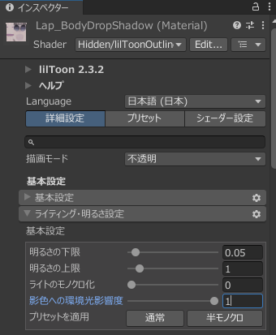

# Tips
---

## 写真の撮り方
- **ポートレートの被写体抜き** を意識するとアバターが映える写真が出来るかもしれません。  
なかなか難しいですが、アバターの現実での身長を想像して構図を意識してみてください。  
- 写真をボケさせる場合は、アバターの立ち位置にピントを合わせてください。
- 仕様上、アバターの手前にボケた物体がある場合になじませるのが難しいです。遮蔽物をボケさせないか、遮蔽物を置かない構図にするのがおすすめです。
- 撮影時のカメラの高さと回転は出来るだけ正確に覚えておくと、Unityでの作業で悩みにくくなります。  
多少ズレても違和感は大きくはありませんが、メモをしておくのもいいですね。

## マテリアルのおすすめ設定
### lilToonの場合
- 差異を無くすために、全ての設定、特に明るさに関する部分は共通化することをおすすめします。
- 「影色への環境光影響度」は全てのマテリアルで1にしておくことを強く推奨します。  
  環境光を操作することで、影色の制御が非常にやりやすくなります。
- 輪郭線を消すと背景と馴染みやすくなりますが、その分情報量が減ってのっぺりすることがあります。
- 加筆予定  
