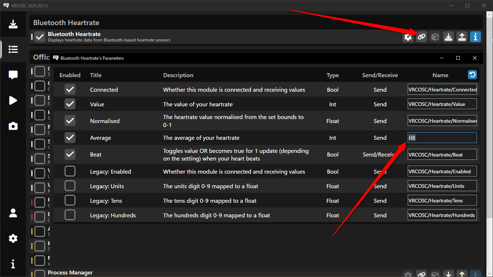

# OSC機能について
---

## 概要
---

:::note
心音ギミックの使用に必須ではありません。
:::
:::caution
2.x.xからアップデートする方へ  
**OSC送信アプリが変更されました！** 3.0からはPulsoidとBLEの両方で共通のアプリを使用します。古いアプリは使用できませんのでご注意ください。  
古いアバターでも使用する方法を [**こちら**](#old-avatar) で案内しています。
:::

心拍数をVRChatに送信することで、心拍数をリアルタイムでアバターと同期させることができます。  
お手持ちのスマートウォッチを介したPulsoidを使用する方法と、Bluetooth Low Energy (BLE)対応の心拍計を使用する方法があります。  
||Pulsoid|BLE|
|:---|:---|:---|
|長所|スマートウォッチをそのまま使用可能|心拍数取得精度が良い 電池が長く持つ |
|短所|スマートウォッチの電池持ちが悪い 導入と起動が面倒|別途購入が必要|

MibandやApple Watchなどのスマートウォッチをお持ちの場合は、まずはPulsoidを試してみることをオススメします。  
ただし、専用の心拍計であればスマートウォッチよりも精度が高く電池の持ちも良いことが多いです。  
導入や起動もPulsoidに比べてかなりシンプルで非常に楽です。  
[オススメの心拍計](https://www.amazon.co.jp/dp/B08882MGXD) です。安いタイミングなら4000円以下で買えます。 

機能性ではBLEの方が優れているので、ギミックがお気に召したらBLE対応の心拍計を購入してみるのも良いでしょう。

よろしければこちらも参考にしてください。  
[VRChatに心拍数を送る時の環境メモ](https://note.com/bekosan/n/nf6a976867771)

## [OSCの設定方法はこちら](/vrc-heart-rate/vrcosc)

### 古いアバターをVRSOSCに対応させる  {#old-avatar}

 クリックして展開 

:::warning
この回避策は一時的なものにとどめ、できるだけ早く全てのアバターを更新することをおすすめします。
:::
1. Modulesタブを開き、PulsoidかBLEの使用する方のチェーンマークをクリックします。

1. Average欄のNameを `HR` に変更します。

