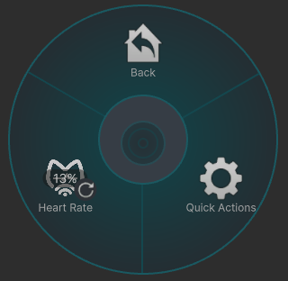
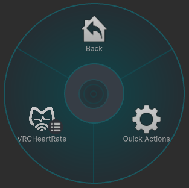
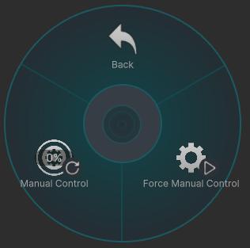

# パイメニュー
---

マニュアルとOSCプレハブで若干生成されるメニューが異なります。  
必要な場合はメニューの追加先を変更することが出来ます。[参考](https://modular-avatar.nadena.dev/ja/docs/reference/menu-installer#%E3%82%A2%E3%82%BB%E3%83%83%E3%83%88%E3%83%A6%E3%83%BC%E3%82%B6%E3%83%BC)

## マニュアルプレハブ
---

- `Heart Rate`: 心拍数を手動で操作します。

## OSCプレハブ
---
 →→→
  

- `VRCHeartRate`: 生成されるメニューの親です。
  - `Manual Control`: 心拍数を手動で操作します。OSC信号がある場合はそちらが優先されます。  
  - `Force Manual Control`: 手動操作された心拍数を強制的に使用します。  
:::tip
パラメーター数削減オプションを有効化すると、OSCプレハブではメニューは省略されます。
:::