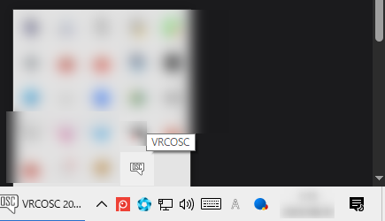
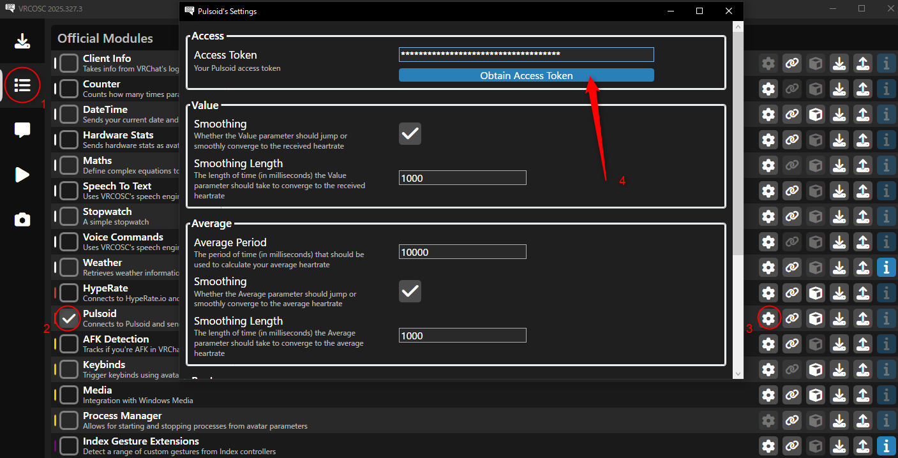
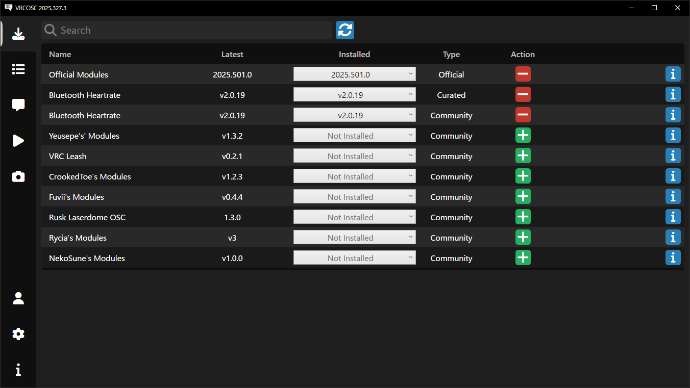

# VRCOSCについて
---

import Tabs from '@theme/Tabs';
import TabItem from '@theme/TabItem';

## 導入方法 {#installation}
---

<Tabs>
    <TabItem value="common" label="共通">
        1. VRCOSCの設定
            1. https://github.com/VolcanicArts/VRCOSC/releases/latest  
            から **VRCOSCSetup.exe** をダウンロード

            1. インストールが完了したらアプリを起動します。起動したはずなのにウィンドウが出ない場合は、タスクバー右の隠れているアイコンを表示するボタンを押してみてください。  
              
            もし、VRCOSCのアイコンが2つ以上ある場合は多重起動で不具合の原因となるので、残り1つになるまで右クリックから終了してください。
    </TabItem>
</Tabs>

<Tabs>
    <TabItem value="pulsoid" label="Pulsoid">
        :::caution
        ！必ずお持ちの端末がPulsoidに対応しているか確認してください！  
        https://www.blog.pulsoid.net/monitors
        :::
        1. Pulsoidの設定  
            https://note.com/kendesu/n/n81275f17986a の 3.2 までを真似する  
            
        1. Modulesタブに移動し、Pulsoidにチェックを入れます。歯車マークをクリックし、 `Obtain Access Token` をクリックします。
        

        1. 右下の Authorize App を押すとトークンが伏せ字で表示されるので、Copy to clipboard でコピーしておきます。  
        **トークンが漏れると他人から心拍数が取得出来てしまうので取り扱いには注意してください。**

        1. VRCOSCの設定画面に戻り、Access Token 欄にペーストします。

        1. Runタブを開き、緑色の再生ボタンを押して起動します。
    
    </TabItem>
    <TabItem value="ble" label="Bluetooth LE">
        :::note
        Bluetooth Low Energy（BLE）に対応した心拍計が必要です。
        :::
        :::caution
        マザーボード内蔵のBluetoothアンテナでは接続できなかったり、不安定になる場合があります。  
        USBドングルを購入して使用することをおすすめします。
        :::
        
        

        1. WindowsにBLE心拍計をペアリングします。  
        :::note
        Windows11 22H2, 23H2の場合、「Bluetoothデバイスの検出」設定を「詳細」に変更してください。  
        24H2では、Bluetoothデバイスの検索で、Bluetoothデバイスのリストを下にスクロールして「すべてのデバイスを表示」を選択してください。
        :::

        2. Packagesタブを開き、Bluetooth Heartrateの最新モジュールをインストールします。(マニュアル執筆時現在)  
        

        1. その下のModulesタブを開き、Bluetooth Heartrateにチェックを入れます。

        1. Runタブを開き、緑色の再生ボタンを押して起動します。
    </TabItem>
</Tabs>

**最後に、VRChatのパイメニュー（円形のもの）を開き、  
オプション > アバター > OSC > 有効  
をオンにします。**

## VRCOSC おすすめ設定

Settingsタブを開きます。
- General
  - Tray
    - Send To Tray On Close: ☑
    - Start In Tray: ☑
- Behavior
  - Modules
    - Run With VRChat: ☑
    - Stop With VRChat: ☑
- Speech (使用しない場合)
  - Configure
    - Enable Speech Engine: □
